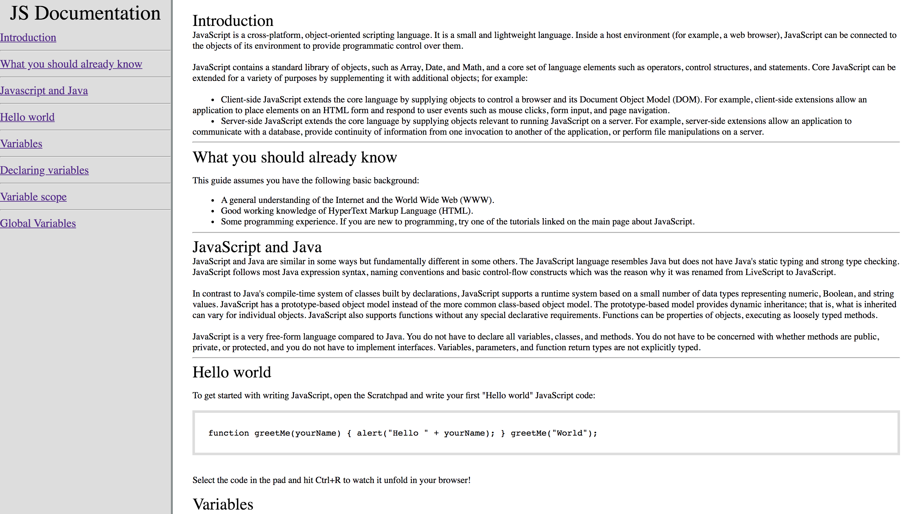

# technical-documentation-

## Introduction

The main purpose of this project is to design a Technical Documentation Page that has navbars and contents. 

## Contents

When a user visits the page, they should be able to click the navbars on the left and each navbar should lead to its specific contents. 

> For example, if a user click the Global Variables, the a tag link will take them there. 

This is a very important skill that everyone can master if they put the time in. 

## Sample Image

